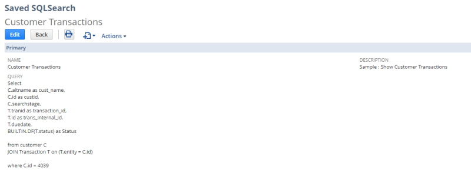
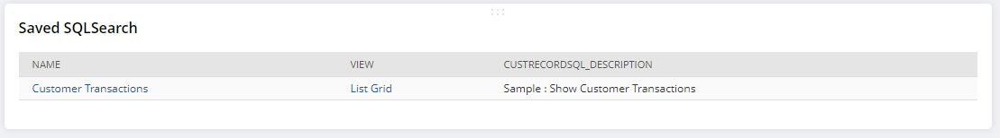
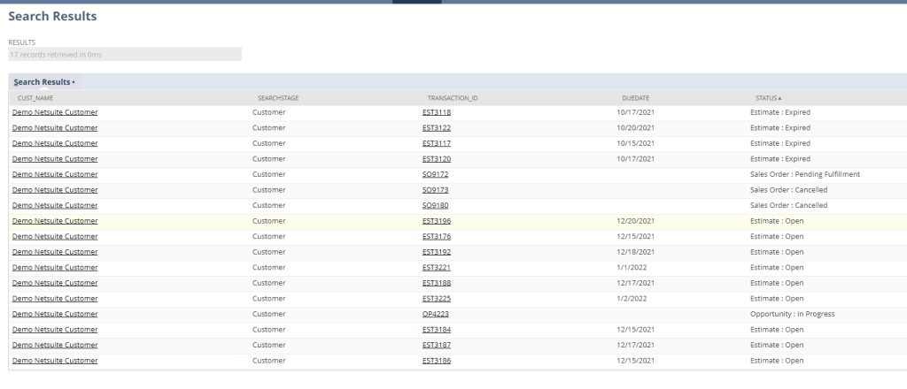
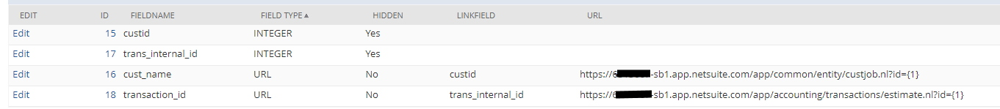

# Netsuite Saved SQLSearch

This is an ALPHA release of a simple tool to see SuiteQL queries in a grid format with links to records in Netsuite.

You can define a SuiteQL query like

`
Select 
	C.altname as cust_name, 
	C.id as custid, 
	C.searchstage, 
	T.tranid as transaction_id, 
	T.id as trans_internal_id, 
	T.duedate,
	BUILTIN.DF(T.status) as Status
from customer C
	JOIN Transaction T on (T.entity = C.id)

`

then you can see the queries in your custom portlet on your dashboard

clicking the link takes you to the Saved SQL Search Suitelet

fields can be hidden or have a record link in the SQL record definition

Know limitations:
1. ROWNUM is not working with N/query and some other commands like TRUNC. I will switch to the new rest service instead on N/query in the future.
2. I removed portlet code for grid link. I was not happy with the JS library chose and prefer just NS lists for now until next release.

Install Notes, should you attemp....
1. This assumes you know how to istall the two custom records and custom list via XML objects.
2. modify gm_SavedSQLSearchResultSuitlet line 13 './../Engine/SSSEngine' to point to the engine JS file if your folder structure is different.
3. modify gm_SQLPortlet lines 24 and 25 href="/app/site/hosting/scriptlet.nl?script=846&deploy=1&dt=list&sqlid= to link to your deployed gm_SavedSQLSearchResultSuitlet record

Future versions will include:
1. Bundle for Deployment
2. Making code account agnostic
3. Inline sub queries (Drill Down)
4. Connection to a content engine to render PDF ot HTML

